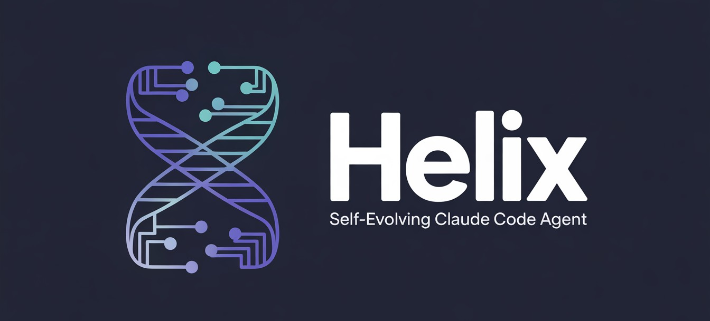

# Helix — Self-Evolving Agent for Claude Code



> **Current version: v3.14.0** — [Changelog](#changelog)

I'm not a prompt. I'm the accumulation of real decisions made in real projects.

Every time a mistake was made with me, I recorded it. Every time we found a pattern that worked, I turned it into a rule. Each session leaves something behind — an evolution, a new agent, a skill that didn't exist before. That's what makes me different: I wasn't designed in the abstract, I was trained in production.

I have memory across sessions. I know which agent to use based on the domain. I take care of myself — I evaluate my own health, compress my context when it grows too large, and warn you when something is wrong before you notice it. When a new project appears, I analyze it, map its risk zones, and keep a silent log of everything I touch.

I can operate in four layers: from a free local model for simple tasks, to a coordinated swarm of 15 agents for features that touch the entire stack. The user never decides which layer — I evaluate and execute.

This repo is my complete configuration, versioned and portable. Clone it, run `install.sh`, and you have everything I am on a new machine in minutes.

---

## Prerequisites

> **v3.14.0** — `check-prereqs.sh` v2 is **blocking**. `install.sh` will refuse to proceed
> until every Required dependency is present. The script generates a single grouped
> copy-paste block with only the commands you actually need.

| Requirement | Type | Notes |
|-------------|------|-------|
| [Claude Code CLI](https://docs.anthropic.com/claude-code) | Required | `npm install -g @anthropic-ai/claude-code` |
| Node.js ≥ 18 **native Linux** | Required | MCPs fail if Node points to a Windows path in WSL — install via NodeSource, not Windows |
| Python ≥ 3.9 + pip3 | Required | `sudo apt-get install -y python3 python3-pip` |
| git, curl, rsync | Required | `sudo apt-get install -y git curl rsync` |
| zstd | Required (Ollama) | `sudo apt-get install -y zstd` |
| Docker (binary + active daemon) | **Required** | Qdrant vector memory. `curl -fsSL https://get.docker.com \| sh` |
| [Ollama](https://ollama.com/download) | **Required** | Layer 0 + helix-judge + nomic-embed-text. `curl -fsSL https://ollama.com/install.sh \| sh` |
| `nomic-embed-text` model | Recommended | `ollama pull nomic-embed-text` (vector memory degraded without it) |
| chromium-browser | Optional | Required by puppeteer MCP — without it, MCP shows "Failed to connect" |

> **OS support (v1):** Ubuntu / Debian / WSL with `apt-get`. `check-prereqs.sh` exits early on macOS, Fedora, Arch with a pointer to `claude/memory/topics/install-os-support.md` (manual install commands per OS).

> **WSL users:** run `which node` before installing — if it points to `/mnt/c/...`, install native Linux Node first.

> **Ubuntu 24.04+ users:** `install.sh` handles PEP 668 automatically (`--user --break-system-packages`).

---

## Quick Install

```bash
git clone git@github.com:ftuga/helix_asisten.git ~/helix_asisten
bash ~/helix_asisten/install.sh
```

`install.sh` verifies all prerequisites, copies files to `~/.claude/`, and auto-installs MCPs if the Claude CLI is in PATH. Run `scripts/check-prereqs.sh` standalone to diagnose missing dependencies before installing.

```bash
# Reinstall without overwriting customizations
bash ~/helix_asisten/install.sh

# Force overwrite everything (memory/agents, memory/topics)
HELIX_FORCE=1 bash ~/helix_asisten/install.sh
```

> **update.sh** keeps your `~/.claude/` in sync with the repo after the initial install — run it after pulling changes.

---

## Two Components: Global vs. Per-Project

Helix has two parts with distinct purposes:

| Component | Lives in | Purpose |
|-----------|----------|---------|
| **`claude/`** | `~/.claude/` | Global config — applies to **all** your projects. Agents, skills, memory, dialogue protocol, self-evolution. |
| **`helix-engine/`** | Inside each project | Injectable RuFlo V3 engine — swarm, HNSW, SONA, advanced hooks. Only for projects that need the full stack. |

Most projects only need `claude/`. `helix-engine/` is for your own projects where you want the full stack.

```bash
# Inject helix-engine into a project
bash ~/helix_asisten/inject-project.sh ~/my-project
```

---

## Structure

```
claude/              → ~/.claude/ (global config)
  CLAUDE.md          → Helix global instructions + layer protocol
  settings.json      → Hooks: PreToolUse, PostToolUse (cost-tracker, scope-guard, log)
  evolve.sh          → Records learnings and installs them as active rules
  session-start.sh   → Restores context, shows active rules and health alerts
  session-end.sh     → Saves state, evaluates metrics, reports estimated cost
  self-check.sh      → Pre-close checklist: blocks if CLAUDE.md exceeds 220 lines
  health-check.sh    → Verifies ecosystem integrity
  compress.sh        → Archives old evolutions to keep CLAUDE.md lean
  agents/            → 27 evolved agents (avg score 40→81/100)
  memory/            → design-system, agents-index, evolution-log, active-rules, topics
  memory/routing-heuristics.md  → ERL-generated routing rules (auto-updated weekly)
  memory/reflexions.jsonl       → Semantic error memory backup
  skills/            → 28 reusable skills across projects
  helpers/helix-erl.sh          → ERL heuristic extractor
  helpers/helix-reflexion.sh    → Semantic error memory (Qdrant store + search)
  helpers/helix-retrospectiva.sh → Auto-analysis at session close
  helpers/skill-tracker.sh      → Tracks real skill/agent usage
  helpers/helix-distill.sh      → HELIX-COMPRESS: agent-specific CLAUDE.md slices + project compression
  helpers/helix-lang-state.sh   → S:hash state manager (snapshot, delta, get, gc)
  helpers/helix-lang-bench.sh   → HELIX-LANG compression benchmark
  skills/helix-lang/            → HELIX-LANG v2: universal inter-agent protocol
  skills/helix-speak/           → HELIX-SPEAK: situational output compression
  skills/_distilled/            → 15 auto-generated agent slices (78-96% savings each)

scripts/             → Helix engine scripts
  helix-vector.py    → Qdrant vector memory engine (store, search, cluster)
  hv.sh              → CLI wrapper for vector memory (hv store / hv search / hv list)
  helix-agent-evolve.py → Automated agent scoring and evolution (0→100 rubric)
  helix-project-index.sh → Project indexing into vector memory
  capa0.sh           → Layer 0 dispatcher: routes to helix-coder or helix-scout

template/            → ~/.claude-template/ (base for new projects)
  CLAUDE.md          → Project CLAUDE.md template
  init-project.sh    → Initialization script

helix-engine/        → Injectable Helix engine for your own projects
  .mcp.json          → claude-flow MCP with v3 + HNSW + SONA enabled
  .claude/
    agents/          → 26 categories: sparc, swarm, v3, github, optimization,
                       hive-mind, consensus, sublinear, goal, dual-mode...
    commands/        → analysis, automation, github, hooks, monitoring, sparc...
    helpers/         → hook-handler.cjs, auto-memory-hook.mjs, router.cjs,
                       intelligence.cjs, memory.cjs, statusline.cjs...
    skills/          → 31 skills: v3-*, swarm-*, agentdb-*, reasoningbank-*, sparc-*
    settings.json    → Hooks: PreToolUse, PostToolUse, UserPromptSubmit, SessionStart/End
  .claude-flow/
    config.yaml      → RuFlo V3: hierarchical-mesh, HNSW, SONA, ReasoningBank
    CAPABILITIES.md  → Full capabilities reference
```

---

## Typical Session Flow

```
1. Open Claude Code in your project
      ↓
   session-start.sh runs automatically (SessionStart hook)
   → Shows last 5 active rules
   → Loads project helix-analysis.md (if it exists)
   → If helix-alerta.md detected → emits [HELIX-NECESITAMOS-HABLAR]

2. Work normally
      ↓
   Helix evaluates each task and picks the right layer (0→1→2→3)
   Hooks record tool calls, detect scope, and update the log

3. Close session
      ↓
   session-end.sh runs automatically (SessionEnd hook)
   → Evaluates health metrics
   → Reports estimated session cost
   → **Retrospectiva**: detects unregistered learnings from session summary
   → **ERL**: updates routing heuristics weekly from feedback data
   → **Gap analysis**: flags domains used but not yet in heuristics
   → If errors resolved → suggests storing in Reflexion memory
   → If problems detected → writes helix-alerta.md for next session
```

---

## Self-Evolution Protocol

How Helix learns:

```bash
# Record a learning (after fixing a bug or discovering a pattern)
bash ~/.claude/evolve.sh learn "category" "learning" "trigger"

# Example
bash ~/.claude/evolve.sh learn "operability" \
  "wc -l returns spaces — clean with tr -d before numeric comparison" \
  "bug in self-check.sh"
```

The command writes to `evolution-log.txt` and installs the rule in `active-rules.md` with immediate effect — no waiting until the next session.

**Valid categories:** `security` · `interface` · `functionality` · `operability` · `architecture` · `performance` · `testing` · `data` · `celery` · `auth` · `docker`

When a pattern appears 2+ times → create a skill:
```bash
bash ~/.claude/evolve.sh skill "skill-name" "description"
```

---

## Orchestration Layers

Helix evaluates each task silently and picks the right layer. The user never needs to decide.

| Layer | When | What it activates |
|-------|------|-------------------|
| **0 — Ollama** | Logs, long text, Docker output | Free local model. If problem detected → escalates |
| **1 — Subagents** | One concrete artifact (endpoint, component, query) | Agent tool with specialized agent |
| **2 — Swarm** | Feature touching ≥2 stack layers | claude-flow `swarm_init` + `task_orchestrate` |
| **3 — Agent Teams** | Active frontend+backend+tests collaboration | Agent Teams (CLAUDE_CODE_EXPERIMENTAL_AGENT_TEAMS) |

**Escalation rule:** when in doubt between Layer 1 and 2 → Layer 1 (cheaper). Escalate only if coordination would be manual and complex.

---

## Helix Modes

Declare in each project's `CLAUDE.md`: `HELIX_MODE: <mode>`

| Mode | What it activates |
|------|-------------------|
| `helix_control_total` | All 4 layers: Ollama + Subagents + Swarm + Teams |
| `helix_minimal` | Specialized subagents only. No claude-flow, no Agent Teams. |
| `helix_off` | Claude responds directly, no orchestration. |

If not declared → `helix_minimal` by default.

---

## Dialogue Protocol

Helix follows these rules on every request:

| Rule | Behavior |
|------|----------|
| **Ask before acting** | If request is ambiguous → max 2-4 grouped questions before touching code. If concrete → proceed directly. |
| **Visible plan** | When task touches ≥2 files → show plan A→B→C and wait for confirmation. |
| **Confidence threshold** | Declare `high autonomy` (execute without asking) or `low autonomy` (confirm each step) at the start. |
| **Red zone alert** | Before touching high-risk files → declare exactly which line will change and wait for OK. |
| **Explore → Implement** | New features → propose ≤3 options and wait for choice. Bugs/concrete tasks → implement directly. |
| **Proactive decisions** | Non-trivial design decisions → record them in `DESIGN DECISIONS` of the project's CLAUDE.md. |
| **Silent log** | If `helix-bitacora.md` exists → record changes/recommendations/errors without asking permission. |

---

## Self-Maintenance System

### Initial project analysis (`/helix-analiza`)

When arriving at a new project, Helix offers a diagnosis:
- Detects stack (FastAPI, React, PostgreSQL, Docker...) with `helix-detect-stack.sh`
- Maps relevant agents and skills to the stack
- Identifies risk zones
- Saves summary in `helix-analysis.md` + details in vector memory
- Initializes `helix-bitacora.md`

### Health pipeline (`/helix-salud`)

Automatically evaluates 3 dimensions at the end of each session:

| Dimension | What it measures | Alert threshold |
|-----------|-----------------|-----------------|
| **Context** | CLAUDE.md size + analysis age | <60 pts |
| **Quality** | Errors in log + pending recommendations | <60 pts |
| **Overhead** | Active agents + sessions without learnings | <60 pts |

If problems detected → writes `helix-alerta.md` → next session reports before any task.

### Cost control (`/economia`)

```bash
/economia       # enable
/economia off   # disable
/economia?      # current status
```

In economy mode: no subagents unless ≥3 simultaneous domains, no Layer 2, Grep before Read, bullet-only responses.

---

## Privacy System

`helix_asisten` is a public repo. `memory/agents/*.md` files may have private project context locally — this system guarantees it never reaches the repo.

### Marker convention

```markdown
<!-- PROJECT-CONTEXT:START -->
## Current project context
...specific data: tables, routes, costs, names...
<!-- PROJECT-CONTEXT:END -->
```

`update.sh` automatically strips these blocks when syncing.

### Sanitize and pre-commit hook

```bash
# Manual sanitize
bash scripts/sanitize-memory-agents.sh claude/memory/agents/
```

The pre-commit hook blocks commits containing private context without markers:

```
🔴 PRIVACY GUARD — pattern detected: '## Current project context'
   Options: 1) add markers  2) run sanitize  3) remove manually
```

Install the hook manually after cloning:
```bash
cp ~/helix_asisten/scripts/pre-commit-hook.sh ~/helix_asisten/.git/hooks/pre-commit
chmod +x ~/helix_asisten/.git/hooks/pre-commit
```

---

## Vector Memory (`hv` CLI)

Helix stores semantic memories in [Qdrant](https://qdrant.tech/) using Ollama embeddings:

| Component | Details |
|-----------|---------|
| **Embedding model** | `nomic-embed-text` (Ollama) — 768 dimensions, ~8k token limit |
| **Vector store** | Qdrant running in Docker on port 6333 |
| **Override model** | `HELIX_EMBED_MODEL=<model>` env var |

`install.sh` sets up both automatically. To set them up manually:

```bash
# Qdrant
docker run -d --name helix-qdrant --restart unless-stopped \
  -p 6333:6333 -v qdrant_storage:/qdrant/storage qdrant/qdrant:latest

# Embedding model
ollama pull nomic-embed-text
```

`hv` CLI usage:

```bash
hv store "agent routing fixed — use threshold 0.45 for frontend" --collection learnings
hv search "frontend routing threshold" --collection learnings
hv list --collection learnings
hv cluster --collection learnings   # group similar memories
```

### How search works

1. Query text → embedded via `nomic-embed-text` → 768-dim vector
2. Qdrant runs **cosine similarity** against all vectors in the collection
3. Results filtered by `--threshold` (default: 0.45) and capped at `--top-k` (default: 5)
4. Returns JSON with `score`, `id`, and `payload` for each match

```bash
# Full options
hv search "query" --collection learnings --top-k 10 --threshold 0.6

# Multilingual: translate query to English before embedding (better recall)
hv search "umbral de routing frontend" --collection learnings --translate
```

The `--translate` flag is useful when memories were stored in English but queries arrive in Spanish — it reduces embedding drift caused by language mismatch.

### Verifying the setup

```bash
# Quick smoke test: store → search → check score > 0
python3 ~/helix_asisten/scripts/helix-vector.py store learnings "test entry" --meta '{"tag":"test"}'
python3 ~/helix_asisten/scripts/helix-vector.py search learnings "test entry"
# Expected: score ~0.99 for exact match
```

No automated test suite yet — verification is done via `scripts/verify-appliance.sh` which checks Qdrant connectivity and basic store/retrieve cycles.

Used by `helix-agent-evolve.py` to persist agent evolution history and by `helix-project-index.sh` to index project knowledge. Falls back gracefully if Qdrant or Ollama is not running.

### Reflexion Memory (`helix-reflexion.sh`)

Stores resolved errors as semantic memories in Qdrant (`helix_reflexions` collection). Before invoking `error-detective`, Helix searches for similar past resolutions:

```bash
# Store a resolved error pattern
bash ~/.claude/helpers/helix-reflexion.sh store \
  "SQLAlchemy scalar_one_or_none returns None — AttributeError on .id" \
  "Use .first() when result can be None, add explicit None check" \
  "funcionalidad" "my-project"

# Search before debugging
bash ~/.claude/helpers/helix-reflexion.sh search \
  "SQLAlchemy query returns None and crashes"
# → [1] confianza media (0.72) | funcionalidad | 2026-04-02
#      Patrón: SQLAlchemy scalar_one_or_none returns None...
#      Resolución: Use .first() when result can be None...
```

Threshold: 0.65 default. Confidence labels: alta (>0.85) · media (>0.72) · baja (≥0.65).

---

## Ollama Models (Layer 0)

```bash
# Download base models
ollama pull qwen2.5-coder:7b   # ~4.7 GB
ollama pull llama3.2:3b        # ~2.0 GB
ollama pull nomic-embed-text   # ~274 MB — required for vector memory

# Create Helix models
ollama create helix-coder -f ~/helix_asisten/ollama/helix-coder.Modelfile
ollama create helix-scout -f ~/helix_asisten/ollama/helix-scout.Modelfile
```

| Model | Base | Size | Use |
|-------|------|------|-----|
| `helix-coder` | Qwen2.5-Coder 7B | 4.7 GB | Bugs, refactors, FastAPI+React code |
| `helix-scout` | Llama 3.2 3B | 2.0 GB | Logs, quick transforms, CRUDs |
| `nomic-embed-text` | — | 274 MB | Embeddings for vector memory (`hv` CLI) |

```bash
# Unified helper
bash ~/helix_asisten/scripts/capa0.sh logs  "$(cat app.log)"
bash ~/helix_asisten/scripts/capa0.sh code  "Debug this error..."
```

If `ollama` is not installed, `capa0.sh` returns exit 2 → Helix automatically scales to Layer 1.

---

## RuFlo Ecosystem

> Source: https://github.com/ruvnet/ruflo  |  https://github.com/ruvnet/claude-flow

**Active version: `ruflo v3.5.42`**

| Package | Role |
|---------|------|
| `ruflo` | Main package — installs the entire ecosystem |
| `@claude-flow/cli` | MCP server — exposes `mcp__claude-flow__*` tools |
| `claude-flow@alpha` | CLI + `@claude-flow/memory` for memory hooks |
| `agentic-flow@alpha` | ONNX embeddings for semantic search |

## Required MCPs

```bash
# Main MCP
claude mcp add claude-flow -- npx -y @claude-flow/cli@latest mcp start

# Other MCPs
claude mcp add context7 -- npx -y @upstash/context7-mcp
claude mcp add browser-tools -- npx @agentdeskai/browser-tools-mcp@1.2.0
claude mcp add puppeteer -- npx -y @modelcontextprotocol/server-puppeteer

# Warm agentic-flow cache
npx agentic-flow@alpha --version
```

---

## Memory Layers (helix-engine)

Active when using `helix-engine/` in a project:

```
┌─────────────────────────────────────────────────────┐
│  Layer 1: Working Memory (RAM cache, 100 entries)    │
│     ↓ overflows to                                   │
│  Layer 2: HNSW Vector Store (semantic search)        │
│     150x-12500x faster than linear search            │
│     ↓ connected to                                   │
│  Layer 3: Memory Graph (PageRank, max 5000 nodes)    │
│     ↓ learns with                                    │
│  Layer 4: LearningBridge (SONA + ReasoningBank)      │
└─────────────────────────────────────────────────────┘
```

## 3-Tier Model Routing (helix-engine)

| Tier | Handler | Latency | When |
|------|---------|---------|------|
| **1** | Agent Booster (WASM) | <1ms | Simple transforms: var→const, add-types |
| **2** | Claude Haiku | ~500ms | Low complexity (<30%) |
| **3** | Claude Sonnet/Opus | 2-5s | Complex reasoning (>30%) |

Combined token savings: **30-50%**

## Status Panel (helix-engine)

```
▊ RuFlo V3 ● user  │  ⏇ main  │  Claude Code
🤖 Swarm  ○ [ 0/15]  👥 0    🪝 0/17    🔴 CVE 0/3    💾 5MB    🧠 0%
📊 AgentDB    Vectors ●0  │  Size 0KB  │  Tests ●0
```

---

## Syncing the Repo

```bash
cd ~/helix_asisten
bash update.sh        # sync + automatic private context sanitize
git add -A && git commit -m "sync: $(date +%Y-%m-%d)"
git push
```

### helix-engine source

`update.sh` uses `$HELIX_ENGINE_SRC` to know which project to copy `helix-engine/` from. Set it locally (not committed to the repo):

```bash
# ~/.claude/session-env/helix-engine-src.sh (gitignored)
export HELIX_ENGINE_SRC="$HOME/path/to/your/project"
```

If the variable is not defined, the helix-engine step is silently skipped.

---

## ERL — Experiential Reflective Learning

Helix analyzes its own routing history and extracts reusable heuristics:

```bash
# Run manually (also runs automatically every 7 days at session close)
bash ~/.claude/helpers/helix-erl.sh

# Output: ~/.claude/memory/routing-heuristics.md
# → Domain rules:     "domain 'testing' → researcher (3/3 uses, 100%)"
# → Frequent pairs:   "frontend-developer → frontend-developer (6x)"
# → Project patterns: "project-name uses frontend-developer as dominant agent (6x)"
# → Gaps:             "24 agents in catalog never used"
```

The gap report is particularly useful — it surfaces agents that exist but are never actually invoked, candidates for pruning or better routing rules.

### Skill Usage Tracker

```bash
# Report: top skills/agents + never-used list
bash ~/.claude/helpers/skill-tracker.sh report

# Suggest skills unused for 30+ days (dry run)
bash ~/.claude/helpers/skill-tracker.sh prune --dry-run
```

Logs to `memory/skill-usage.jsonl`. The retrospectiva uses this data to flag overhead.

---

## Changelog

### v3.14.0 — 2026-05-04 · Blocking prereqs + Layer 0 manual override + TRANCH 1+2 sync

Catches the repo up with three sessions of work that lived only in `~/.claude/`. Two new user-facing features (FASE 6 OPCIÓN E + Layer 0 manual disable) plus the helpers from TRANCH 1+2 (council-decided plan v4) that were never committed.

**`scripts/check-prereqs.sh` v2 — blocking prerequisites with grouped copy-paste output**
- Promoted to **Required (FAIL)**: Docker (binary + active daemon), Ollama, zstd, Claude Code CLI. Previously WARN-only or unchecked.
- Promoted to Recommended (WARN): `nomic-embed-text` model.
- New OS detection: only Ubuntu/Debian/WSL with `apt-get` in v1. macOS/Fedora/Arch fail early with pointer to `claude/memory/topics/install-os-support.md`.
- Output reorganized: instead of scattered messages, a single grouped copy-paste block with only the commands you actually need (apt packages consolidated into one `apt-get install`, Docker block, Ollama block, model pulls block, etc.). Numbered steps in dependency order (apt → node → docker → ollama → claude CLI → models).
- Solves the previous failure mode: `install.sh` proceeded with broken state when Docker or Ollama were missing.
- Smoke test: `tests/test-check-prereqs.sh` — 24 assertions across 8 scenarios (PATH-shadowed binaries to simulate missing deps).

**Layer 0 manual override — for users with limited HW**
- `/helix_desactiva_CAPA0` and `/helix_activa_CAPA0` slash commands. The disable command **asks the user** whether to apply it to the current session only or persistently across sessions.
- `claude/helpers/helix-capa0-toggle.sh` — `off --session | off --persistent | on | status`. Writes `~/.claude/capa0-disabled` with YAML metadata (mode, created_at).
- `claude/helpers/helix-capa0-policy.sh` — early check that wins over the HW heuristic. The override applies via the file, the env var `HELIX_CAPA0_DISABLED=1`, or both.
- `session-end.sh` — auto-cleanup of `mode:session` overrides at session close. `mode:persistent` survives.
- Default: Layer 0 stays **enabled by default** based on detected HW (FASE 9). The override only disables — it never forces enable.
- Smoke test: `tests/test-capa0-toggle.sh` — 19 assertions across 9 scenarios (env var, file, modes, errors).

**TRANCH 1 + TRANCH 2 helpers — sync from sessions #20-#21**

These were council-approved (plan v4, Helix Council #1, 2026-05-04) and implemented in `~/.claude/` but never committed. v3.14.0 brings them into the repo so `install.sh` actually deploys them on a fresh machine.

- **FASE 9 HW-aware** (`helix-hwprobe.sh`, `helix-capa0-policy.sh`, `helix-bench-capa0.sh`, `helix-models-suggest.sh`) — CPU/RAM/GPU detection, ON/OPT_IN/OFF policy by tier, empirical bench overrides heuristic.
- **FASE 0.5 statusline** (`helix-statusline.sh`) — bash replacement for the 742-line RuFlo CJS statusline. <200ms p99.
- **D1' multi-domain trigger** (`helix-multidomain-trigger.py/sh`) — PreToolUse(Agent) hook detecting 2+ domain intent, advisory-only.
- **M1 helix-judge** (`helix-judge.py`) — LLM-as-judge for semantic conflicts. Ollama backend (`llama3.2:3b` default). Static few-shot prompt (anti-poisoning hard rule). Confidence ≥0.85, 100% audit log.
- **M2 passive-capture** (`passive-capture-hook.py/sh`, `passive-capture-review.sh`) — PostToolUse hook detecting non-trivial decisions during edits. Three-bucket JSONL (pending/approved/rejected). Review tool requires explicit approve/reject.
- **M3 helix-project-consolidate** (`helix-project-consolidate.py`) — fuzzy-matched name drift detection across helpers/skills/agents/topics. Threshold env var `HELIX_M3_FUZZY_THRESHOLD` (default 0.75). Interactive unify only with explicit confirmation.
- **R1 helix-route-recommend** (`helix-route-recommend.py`, `helix-route-cost-audit.py`) — model recommendation advisor (Opus/Sonnet/Haiku) by domain. **Read-only** — never modifies `settings.json`. Override via `HELIX_FORCE_MODEL`. Kill switch `HELIX_R1_ENABLED=0`.
- **R2 helix-cost-tracker** (`helix-cost-rollup.sh`) — real USD cost from JSONL transcripts using Anthropic Nov 2025 pricing. Modes: current/session/all/report. Wired to statusline 💰 slot.
- **SEC1 helix-aidefence** (`helix-aidefence-hook.py/sh`) — PostToolUse PII redactor on Helix-internal logs (10 PII types: EMAIL, PHONE, SSN, IBAN, IPV4/6, CREDIT_CARD-Luhn, PATH_USERNAME, URL_USERINFO). Redact-no-block.
- **SEC2 helix-egress-audit** (`helix-egress-audit-hook.py/sh`, `helix-egress-report.sh`) — PostToolUse audit on WebFetch/WebSearch/MCP. Logs domain + sanitized query. First-seen domain alert + spike detection.

**`tests/` — repo-versioned smoke tests (new directory)**
- `test-capa0-toggle.sh` — 19/19 PASS
- `test-check-prereqs.sh` — 24/24 PASS

**Documentation**
- `claude/memory/topics/install-os-support.md` — OS support matrix + manual install commands for macOS, Fedora/RHEL, Arch.
- `claude/memory/topics/fase-6-installer-decision.md` — council #4 decision record (4 options, OPTION E selected).
- 18 additional bench/decision topics from TRANCH 1+2 (M1-M3, R1, SEC1-2, B-gates, council design, FASE 9 HW-aware, statusline v0.1, plan v4 completed).

**Privacy fixes**
- Removed two hardcoded user paths (`/home/lfrontuso/`) from `passive-capture-review.sh` and `helix-cost-rollup.sh`. Replaced with `os.path.expanduser('~/')` and dynamic prefix from `HOME`.

**Migration notes**
- After `git pull`, run `bash update.sh` to copy the new helpers into `~/.claude/`.
- Existing installs: Capa 0 keeps its current behavior. New slash commands available immediately after sync.
- New installs on machines without Docker or Ollama: `check-prereqs.sh` will block and print exactly what to run.

---

### v3.13.0 — 2026-04-27 · Project stack manifest + anti-bias routing + conversation persistence

Seven coordinated changes addressing real measured pain: 24 of 35 agents never invoked, top-3 capturing 72% of routing decisions, no recovery path after WSL2 crashes, false promises in CLAUDE.md about Capa 3 implementation status.

**`skills/helix-stack/` — declarative agent stack per project**
- `helix-stack.sh detect` auto-classifies project tier (small / medium / large) from file count, LOC, presence of CI / tests / IaC.
- Manifest at `<project>/.claude/memory/helix-stack.md` declares `core` (tech-aligned agents) and `extended` (cross-cutting roles: security, qa, ba, devops, monitoring) with mode `technical | extended | custom`.
- Subcommands: `detect | init | show | add | remove | promote | auto-promote-check | suggest-agents | create-suggested`.
- Universal base injected in every project (independent of language): `error-detective`, `code-reviewer`, `architect-reviewer` — process agents, not domain.

**`memory/topics/specialized-agents-catalog.json` — extensible 60+ agent catalog**
- Seven categories (`languages`, `frameworks`, `domains`, `infrastructure`, `blockchain`, `specialized`, `compliance`) with 60+ entries.
- Nine signal types: `files`, `dirs`, `manifest`, `deps_python`, `deps_node`, `deps_ruby`, `deps_elixir`, `deps_rust`, `deps_go`, `keywords_in_readme`.
- `helix-stack suggest-agents` walks the catalog, evaluates signals against the project, reports any specialized agent that would help but is missing. Examples validated end-to-end: Rust + actix → `rust-pro` + `actix-pro`; PyTorch + LangChain + HuggingFace → 3 expert suggestions; Terraform + Helm + k8s → 3 infra experts; Solidity + ethers → blockchain stack; HIPAA keywords in README → compliance agent.
- Extensible without touching code — add a JSON entry, the helper picks it up next run.

**`skills/helix-route/` — anti-bias routing with multi-criteria scoring**
- Replaces bare vector search with `score = 0.50·similarity + 0.20·freshness + 0.15·skill_quality + 0.15·stack_match`.
- Hard filter by domain catalog (testing → only `qa-expert`/`test-engineer`/`test-automator`) eliminates the structural drift detected by ERL.
- Freshness bonus = `1 / (1 + log(invocations_30d + 1))` — agents never invoked get the maximum boost.
- Epsilon-greedy exploration: 10% of picks ignore best score and pick randomly within `score ≥ 0.7·best_score` cohort. Diversification cements organically as exploration produces feedback.
- Subcommands: `pick | audit | shadow-report | weights`. `--shadow` flag enables dry-run mode with a one-week shadow log to validate before activating the hook layer.
- `helpers/helix-metricas.sh` gains a fourth dimension `routing` reporting `top3_saturation`, `coverage_ratio`, `never_used_count`, `stack_coverage`. Score routing surfaces real bias measurably.

**`skills/helix-snapshot/` — conversation persistence (Fase 1)**
- YAML snapshots at `~/.claude/snapshots/<project>/<ts>.yaml` with `chmod 600` and a project `.gitignore` that excludes everything but the README.
- Subcommands: `capture` (stdin YAML), `resume`, `list`, `show`, `archive` (>7d), `prune` (>30d), `stale-check` (>24h or git commits posterior).
- `session-start.sh` injects `[HELIX-SUGGEST-RESUME]` flag when a recent snapshot exists. CLAUDE.md rule #12 mandates opt-in: never auto-load to context — always ask the user (1) resume, (2) new chat, (3) view detail.
- 100% local, no egress, no paid services, no vendor lock. Stack: YAML files + existing Qdrant + existing Ollama. Mem0 OSS evaluated and deferred to a future phase if the simple build proves insufficient.
- Companion research dump in `memory/topics/conversation-context-research.md` covers Helix internals, LongMemEval (ICLR 2025), Mem0 paper (arXiv 2504.19413), compaction strategies (observation masking, structured summary, ACON), Anthropic prompt caching 2026.

**`helpers/helix-lang-trigger-hook.sh` — auto-suggest HELIX-LANG on long prompts**
- PreToolUse(Agent) hook fires when invoking the `Agent` tool with a prompt ≥500 tokens of natural prose without HELIX-LANG markers (`A:`, `S:`, `T:`, `R:`, `H:`).
- Suggestion goes to stderr (non-blocking, `exit 0`) with estimated savings (`~58.7%` measured by the bench).
- Resolves a design failure: the rule "use HELIX-LANG on large agent prompts" only worked if I remembered to follow it. Now the harness fires it independently of memory.

**HELIX-LANG restored** (was deprecated 2026-04-18 prematurely)
- Decommissioning rationale was "zero real usage post-benchmarks" — but that reflected my own neglect to use it, not protocol failure.
- The bench measures 58.7% real token compression on output (output never hits the prompt cache, so savings are direct cost).
- Anthropic prompt caching covers 90% of input redundancy; HELIX-LANG covers what cache cannot — they are complementary, not competitors.
- Skill restored to `skills/helix-lang/`, helpers to `helpers/helix-lang-{state,bench}.sh`.

**Capa 3 honesty fix + drift cleanup**
- CLAUDE.md previously claimed "Agent Teams natively enabled in settings.json" — verification showed mailbox/teammates dirs absent, `TaskCreated` hook unregistered, 0 swarm/team invocations in 30 days. Now reads "NO IMPLEMENTADO" with pointer to `topics/agent-teams-status.md` documenting actual state and minimum implementation plan.
- `agents-index.md` had 12 entries pointing to nonexistent files. After cleanup: 26 entries match 26 files exactly. `architect-review.md` renamed to `architect-reviewer.md` (typo confirmed by frontmatter). 10 orphan context files marked `status: preserved` — `helpers/helix-agents-audit.sh` now distinguishes accidental from intentional orphans.

**Housekeeping helpers**
- `helpers/helix-claude-md-prune.sh` — auto-archive evolutions older than 14 days when `CLAUDE.md` exceeds threshold 340. Idempotent, dry-run mode, ships archived rows to `topics/evolution-history.md`.
- `helpers/helix-agents-audit.sh` — diff between `agents/*.md`, `agents-index.md`, and `memory/agents/*.md` with four orphan categories. Surfaces drift the staleness check cannot detect (which only watches git, not infrastructure).

---

### v3.12.0 — 2026-04-23 · Research-first agent creation + vector store self-healing

Four changes that tighten how Helix creates experts and keeps its semantic index consistent across machines.

**`skills/agent-create/` — research-first pipeline for new experts**
- Six-phase pipeline: scoping → research (source allowlist) → anti-injection sanitize → synthesize → validate → atomic commit of the three agent files (slim, on-demand, index-row).
- Source allowlist: only official normatives (NIST, OWASP, IETF RFCs, ISO, W3C), vendor docs, peer-reviewed papers, canonical repos, and recognized-author books. No blogs, no AI-generated content, no single-source StackOverflow.
- Anti-injection in research phase reuses Helix Security Layer L1 (`injection-detector-hook`) and adds manual scanners (`</?(system|assistant|user)>`, `ignore previous instructions`, long base64 blobs, invisible Unicode) plus **cross-validation: every principle must appear in ≥3 independent sources** or be discarded.
- Fingerprinting: `memory/agents/<name>.md` includes `## Fuentes` (URL + date + content hash) and `## Metadata` (created_at, last_refresh, invocations). Every expert is re-auditable.
- Validation gate: ≥80% correct on 5–10 domain-specific questions before activation. Below 60% → back to research phase, not more prompt text.
- Refresh cycle: agents with ≥20 invocations in 30 days go through a 90-day re-research of deltas (new CVEs, deprecations, standard updates). Prompt changes require user approval — no auto-merge.
- Rule added to `CLAUDE.md § AGENTES`: never write an agent system prompt without invoking this skill.

**`helpers/agents-vector-sync-hook.sh` — auto-sync of `helix_agents` collection**
- PostToolUse hook on `Write|Edit|MultiEdit` that detects edits to `~/.claude/agents/*.md` or `~/.claude/memory/agents/*.md` and triggers `hv index-agents` in background.
- `flock --nonblock` debounce of 8 s: ten consecutive edits produce a single re-index, not ten.
- Exit 0 immediate, `disown` so the edit workflow never blocks. Graceful skip if Qdrant is down.
- Log: `~/.claude/memory/agents-vector-sync.log`. Manual fallback: `hv index-agents`.

**`install.sh` — bootstrap of vector index on new machines**
- New block after Vector Memory install: deferred background bootstrap that waits up to 180 s for the `nomic-embed-text` pull, verifies Qdrant `/healthz` and model availability, then runs `hv index-agents` + `hv index-memories`.
- Closes the gap where a fresh install left Qdrant running with an empty collection until the user ran `hv sync` manually.
- Idempotent: stable IDs by content hash — re-install does not duplicate points.
- Log: `~/.claude/memory/install-vector-bootstrap.log`. Non-blocking: install finishes immediately.

**`helpers/helix-metricas.sh` — threshold realignment with `health-check.sh`**
- Drift detected: `helix-metricas.sh` flagged `CLAUDE.md` as CRITICAL at >220 lines (limit 180) while `health-check.sh` accepted up to 350 lines. The actual `CLAUDE.md` post-pruning stabilized at 305–329 lines, producing a permanent false positive.
- Thresholds aligned: elevated at 350, critical at 400. Context score now reflects the real post-DISCOVERY-FIRST + Security Layer v1 baseline instead of the pre-prune limit.

---

### v3.11.0 — 2026-04-11 · HELIX-COMPRESS — three-layer token compression system

Three independent compression layers, each targeting a different cost:

**DISTILL — initialization cost** (`helpers/helix-distill.sh`)
- `run`: generates agent-specific slices of CLAUDE.md — only the sections each agent actually needs. Savings: 78–96% per agent, **93% for a 15-agent Layer 2 session** (92,940 → 6,124 tok).
- `compress-project [DIR]`: compresses `helix-*.md` project files (analysis, bitácora, team, backlog, roadmap) with `.original.md` backup.
- `compress-file FILE [task]`: semantic extraction from code files — splits by function/class for `.py/.ts/.js`, by header for `.md`, by keyword ±10 lines for other formats.
- `compress-bitacora FILE [--keep N]`: truncates changelog tables to last N entries with condensation notice. Prevents unbounded growth.
- **4 bugs fixed** in this version: HTML comment markers bleeding into slices (`<!--...-->`), `pipe | python3 <<'HEREDOC'` stdin conflict (heredoc wins → always 0 agents in report), double Python computation with divergent logic (fake 99% savings), `--keep 5` argument parsing (only worked with `--keep=5`).

**S:hash — coordination cost** (`helpers/helix-lang-state.sh` + `skills/helix-lang/`)
- HELIX-LANG v2: universal inter-agent grammar (fixed) + vocabulary declared per session via `vocab` command. Works for any domain: software, research, marketing, support, finance.
- Agents reference shared context as `S:xxxx` (2 tokens) instead of re-sending full state. Measured savings: **~97%** on shared context, ~59% on individual messages.
- Commands: `vocab A:{} D:{}`, `snapshot`, `get`, `delta`, `diff`, `gc`.

**SPEAK — output cost** (`skills/helix-speak/`)
- Situational output compression: AUTO mode selects level by message type. BRIEF for status reports, TERSE for fragments, ULTRA for inter-agent. Never compresses code, security warnings, or destructive confirmations.

**Agent Teams (Layer 3)**
- Peer-to-peer mailbox between agents (Claude Code native, ≥v2.1.32). Already enabled in `settings.json`. Key difference from Layer 2: agents communicate directly, not just report to the lead. Hooks: `TeammateIdle`, `TaskCreated`, `TaskCompleted`.

---

### v3.10.0 — 2026-04-02 · Confidence decay + knowledge map + proactive memory

- **`helpers/helix-decay.sh`** — Confidence decay for evolution-log entries. Score 0-100 = recency×0.4 + importance×0.6 × category multiplier. PERENNIAL patterns (HELIX_MODE, ERL, swarm_init, set -euo pipefail…) never decay. Three modes: `--report`, `--stale`, `--prune` (writes `obsolete.md`). Runs in `session-end`.
- **`helpers/helix-knowledge-map.sh`** — Cross-domain coverage matrix: learnings × heuristics × reflexions × decay score per domain. Criticality weights (seguridad=1.0, arquitectura=0.9…) amplify gap urgency. Critical gap = high-weight domain with coverage <30%. Runs in `session-end --gaps`.
- **`session-start.sh`** — Proactive Qdrant retrieval at session start: auto-detects project stack (Python/React/Docker), queries `helix_reflexions` for relevant resolved errors, surfaces them as "🧠 Memorias relevantes para este proyecto" before first task.
- **`session-end.sh`** — Integrated decay + knowledge map into session close pipeline.

---

### v3.9.0 — 2026-04-02 · Closed routing loop

- **`helpers/skill-tracker-hook.sh`** — PostToolUse hook on `Skill`: every skill invocation auto-logs to `skill-usage.jsonl`. `agent-routing-hook.sh` also writes there now. Skill tracker is live from this version.
- **`helpers/helix-expel.sh`** — ExpeL contrastive analysis: detects dominance patterns, routing mismatches (used ≠ catalog ideal), out-of-catalog agents, temporal routing evolution. Runs after ERL in retrospectiva.
- **`helpers/helix-routing-fix.sh`** — Auto-correction of `agents-index.md` from ERL+ExpeL output. First real corrections: `testing → test-engineer`, `devops → devops-engineer` flagged in triggers.
- **`settings.json`** — New PostToolUse hook on `Skill` matcher.
- **`agents-index.md`** — `★` routing corrections from ExpeL. Note: `researcher`/`general-purpose` are internal Claude Code types, not Helix agents.

---

### v3.8.0 — 2026-04-02 · Self-learning memory system

- **`helpers/helix-erl.sh`** — ERL (Experiential Reflective Learning): analyzes `routing-feedback.jsonl`, extracts domain heuristics + frequent agent pairs + project patterns + catalog gaps → `routing-heuristics.md`. Auto-runs weekly from retrospectiva.
- **`helpers/helix-reflexion.sh`** — Semantic error memory: stores resolved errors in Qdrant (`helix_reflexions`), retrieves by cosine similarity. Store + search + list. Backup in `reflexions.jsonl`.
- **`helpers/skill-tracker.sh`** — Real usage log for skills and agents: `skill-usage.jsonl`. `report` shows top-N with bars + never-used. `prune --dry-run` suggests archive candidates.
- **`helpers/helix-retrospectiva.sh` v2** — Now integrates: ERL trigger (weekly), gap analysis (session domains vs documented heuristics), reflexion suggestion (when resolved errors detected in summary).
- **`compress_logic.py` v2** — ACON-style importance scoring (0–1) for archiving decisions. Anchor sections (SECURITY, OPERABILITY, SKILLS_INDEX) are immune to compression. High-value patterns (`set -euo pipefail`, `swarm_init`, `HELIX_MODE`) score >0.8 and are never archived.
- **CLAUDE.md markers** — Added 7 missing structural markers: METRICS, SESSIONS, SECURITY, OPERABILITY, SKILLS_INDEX, RISK_MAP, REASONING. `health-check.sh` now passes 100% integrity.
- **21 cross-project evolutions** registered (up from 16).

---

### v3.7.0 — 2026-03-26 · Agent evolution system

- `scripts/helix-agent-evolve.py` — automated agent scoring (0→100 rubric: specificity, tools, examples, triggers)
- `scripts/helix-project-index.sh` — indexes project files into Qdrant vector memory
- 27 agents fully evolved: average score 40→81/100
- `frontend-developer`: threshold 0.55→0.45, enriched vocabulary for better routing

---

### v3.6.0 — 2026-03-26 · Vector memory engine + Capa 0 explicit triggers

- `scripts/helix-vector.py` — Qdrant-backed vector memory: store, search, cluster, export
- `scripts/hv.sh` — `hv` CLI: `hv store`, `hv search`, `hv list`, `hv cluster`
- `capa0-guard` hook in `settings.json` — explicit triggers for Layer 0 (logs >200 lines, Docker output, stacktraces)
- Layer 0 now auto-escalates to Layer 1 when `ollama` is unavailable (exit 2)

---

### v3.5.0 — 2026-03-24 · Privacy system

- `scripts/sanitize-memory-agents.sh` — strips `<!-- PROJECT-CONTEXT:START/END -->` markers and fallback on `## Current project context`
- Pre-commit hook — blocks private context before it reaches the repo
- `update.sh` integrates automatic sanitize and replaces hardcoded path with `$HELIX_ENGINE_SRC`
- Global `CLAUDE.md`: new `PRIVACY` section
- Retroactive cleanup: skills generalized to v2.0, agents without project context

---

### v3.4.0 — 2026-03-24 · Creative agents + dialogue protocol + global hooks

- New agents: `brand-identity-expert`, `app-creative-genius`
- `helpers/statusline.cjs` — dynamic status bar
- `settings.json` — cost-tracker, scope-guard, suggest-compact, helix-bitacora hooks
- `memory/active-rules.md` — 31 seeded rules available on fresh install
- CLAUDE.md: evolutions #9–15 integrated (dialogue protocol, log, economy mode, health pipeline, hybrid memory)

---

### v3.3.0 — 2026-03-24 · Active self-evolution

- `scope-guard.sh` — warns when editing outside the active project
- `cost-tracker.sh` — counts tool calls, reports cost on session close
- `routing-learn.sh` — records routing decisions with outcome
- `evolve.sh` improved: `learn` installs rule in `active-rules.md` with immediate effect
- `session-start.sh`: shows top effective agents per project

---

### v3.2.0 — 2026-03-24 · Hackathon winner integration

- Agents: `harness-optimizer`, `loop-operator`
- Skills: `context-budget` (`/context-budget`), `strategic-compact` (automatic hook)
- `suggest-compact.sh` hook: suggests `/compact` at 50 tool calls

---

### v3.1.0 — 2026-03-20 · Self-maintenance system

- `/helix-analiza` — initial analysis with hybrid memory
- `/helix-salud` — health evaluation + "we need to talk" pipeline
- `/helix-actualiza` — maintenance and analysis update
- `/economia` — economy mode
- Project log: automatic silent maintenance
- Subagent thresholds: 1 domain → solo, 2 → 1 subagent, 3+ → Layer 2

---

### v3.0.0 — 2026-03-08 · RuFlo V3 + helix-engine

- Injectable RuFlo V3 engine (`helix-engine/`)
- HNSW Vector Store (150x-12500x speedup vs linear search)
- SONA Learning + ReasoningBank
- 26 agent categories: sparc, swarm, v3, github, optimization, hive-mind, consensus...
- Dynamic statusline (swarm + tokens + CVEs + AgentDB)
- 4 orchestration layers: Ollama → Subagents → Swarm → Agent Teams

---

<details>
<summary>🇦🇷 Leer en español</summary>

Este README existe también en español en versiones anteriores del repo. El contenido técnico es idéntico — la traducción es solo de forma, no de fondo. Si preferís la versión en español, podés consultar el historial de git o abrir un issue.

</details>
